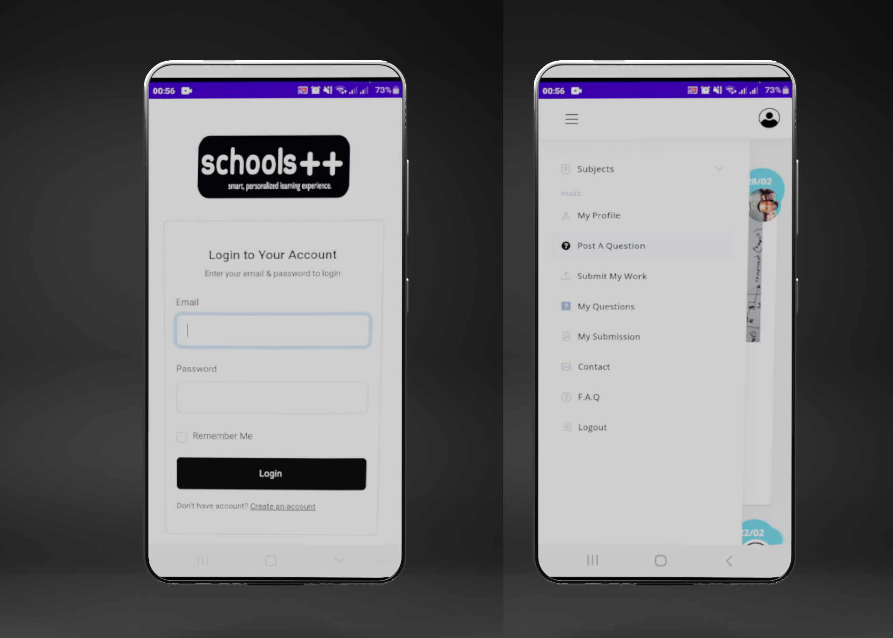
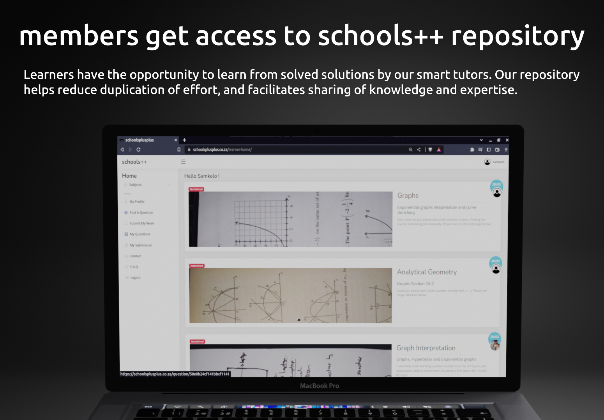
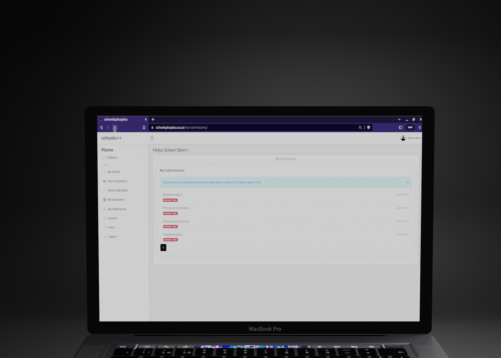

# Private Repo Project - Deployed on an Ubuntu Server 
please see (https://www.schoolsplusplus.co.za)

## Frontend (Edited)

 Templates Used \
================================================== \
 Template Name: AdminLTE - v2.5.0 \
 Template URL: https://bootstrapmade.com/ \
 nice-admin-bootstrap-admin-html-template/ \
 Author: BootstrapMade.com \
 License: https://bootstrapmade.com/license/ \
======================================================== \

## Backend - Python Flask

Development Language - Python \
Server - Nginx

## Mobile App + Web App

  

## About Project

schools++ is an innovative online learning channel for high school learners.

## Use Cases
#### Learner Profile \
- client, user. Learner sees only questions in their grade. Create post(Question post), Edit Post, Delete Post, Comment and Upload. Each account has access to only two subjects (e.g Mathematics and Natural Sciences) for grades 7 - 9.
#### Tutor Profile \
- Comment, Reject Post(Assigned task), Reject Submission, Upload Feedback (Marked File) . Completes tasks(questions by learners) and marking uploaded documents. Tutor only sees questions that are assigned to. Access to all grade content (grades 7 - 12).
#### Admin Profile \
- Edit Post, Delete Post, Comment and Upload. Manages tutor applications, verifies all account activities, allocates tasks and submissions to tutors.

1) Learner posts a question.

2) Admin allocates question to Tutor 
3) Tutor provides solution or guidance.
4) Learner marks question completed, soolved question is made public to all learners registered for that specific grade.

## Other Features

- Learner uploads their practice answer sheet, tutor will mark and send back a marked file.

##### -Profile Update
##### -Edit/Update Question
##### -Reject Question (Tutors)
##### -Admin (Allocate submissions, Questions, Process Applications on Admin dashboard.)

