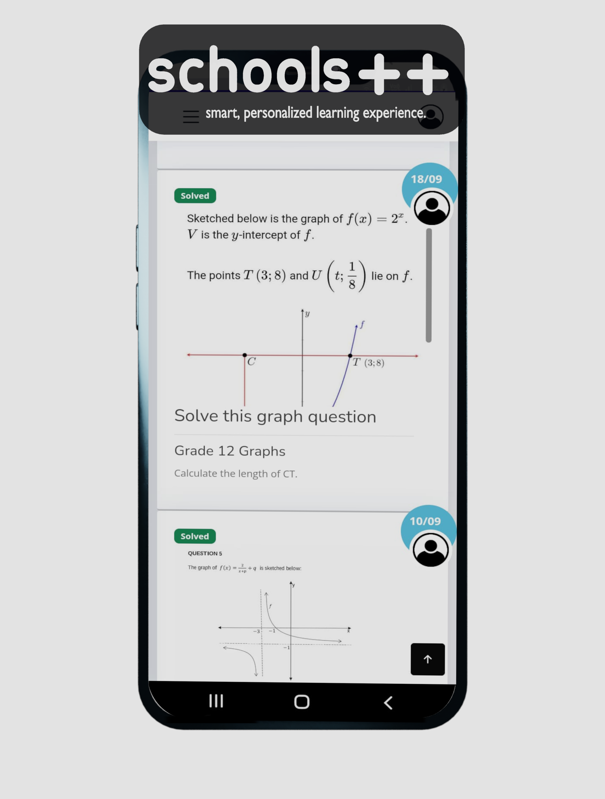

## schoolsplusplus.co.za E-Learning WebApp 

Online learning web app for high school learners. Learners can watch video tutorial, submit exercise work for marking and post questions.
- Grades 10 - 12, have access to Maths, Sciences and Accounting.
- Grade 7 -9 have access to Math and Natural Sciences content.

## Tech stack:
- Flask, Supervisor, Gunicorn, Unicorn as worker
- HTML, CSS, JavaScript
- SQlite Database
- Jinja2
- Python 3.6+

## Messaging
- FlaskSocketIO (5.2.*)
- JavaScript SocketIO (4.2.*)

## Web App
Android app is just a web view.

## Use Cases
#### Learner Profile 
- Create post(Question post), Edit Post, Delete Post, Comment and Upload.
- Live chat
- Watch private and public video tutorials

  
   

#### Tutor Profile 
- Comment, Reject Assigned task, Reject Submission
- Upload Marked File. 
- Tutor can ccess all grades content (grades 7 - 12)
- Live chat

#### Admin Profile 
- Manages tutor applications
- Verify account activities (Activate and Deactivate)
- Process Payment queries
- Account recovery
- allocates tasks and submissions to tutors.

## Webview 

## Mobile view

